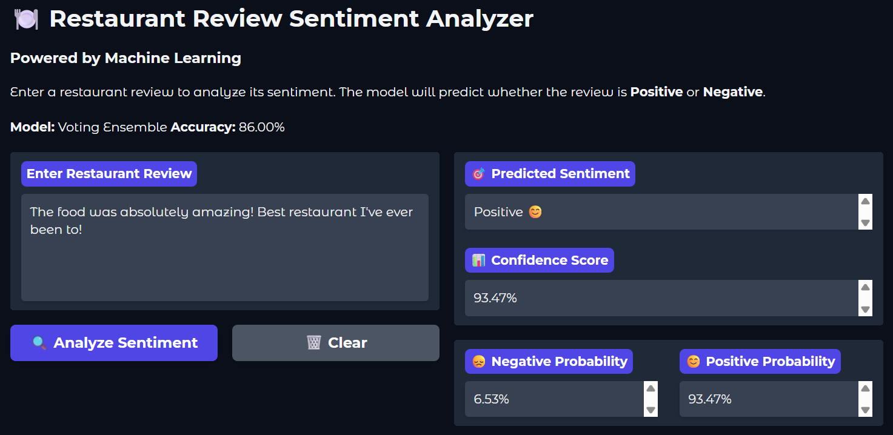
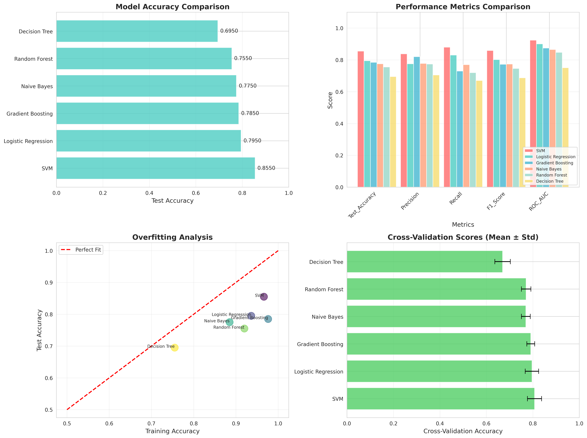
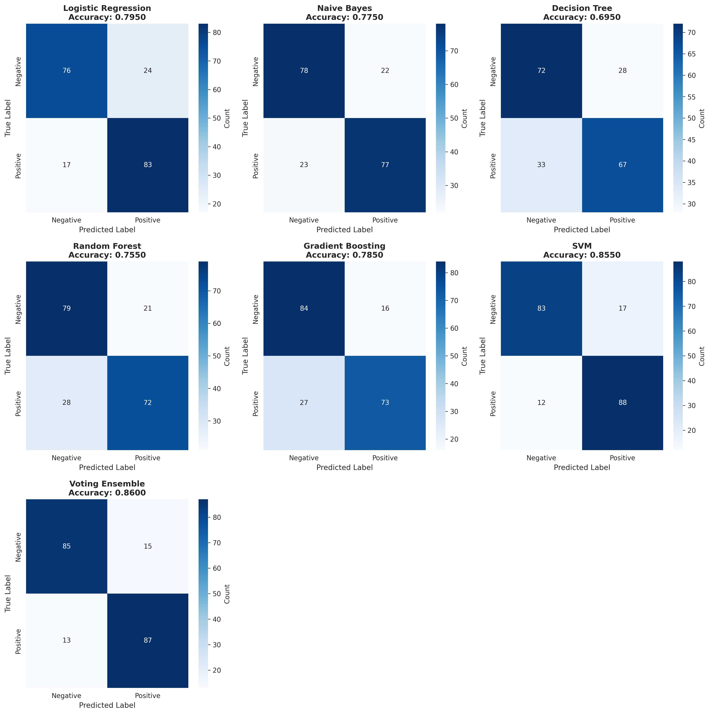
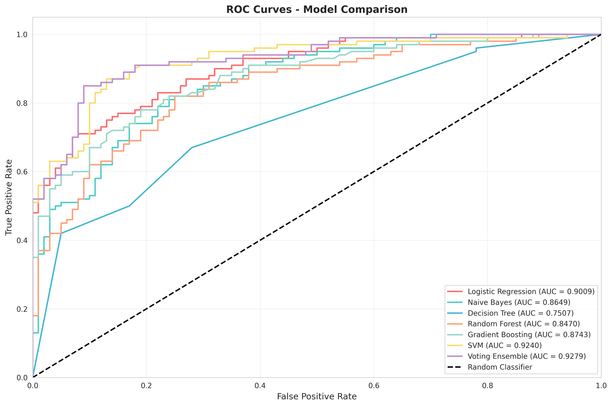

# 🍽️ Restaurant Review Sentiment Analyzer

An AI-powered sentiment analysis system that classifies restaurant reviews as positive or negative using advanced machine learning and natural language processing techniques.

## 🚀 Live Demo

**Try it here:** [Hugging Face Space](https://huggingface.co/spaces/Elliot89/sentiment-analysis-restaurant)

---

## 📋 Table of Contents

- [Project Overview](#project-overview)
- [Features](#features)
- [Model Performance](#model-performance)
- [Technologies Used](#technologies-used)
- [Project Structure](#project-structure)
- [Installation](#installation)
- [Usage](#usage)
- [Methodology](#methodology)
- [Results](#results)
- [Future Enhancements](#future-enhancements)
- [Contributing](#contributing)
- [License](#license)
- [Author](#author)

---

## 🎯 Project Overview

This project implements a **complete end-to-end machine learning pipeline** for sentiment analysis of restaurant reviews. The system:

- Preprocesses text data using advanced NLP techniques (lemmatization, custom stopwords, regex cleaning)
- Engineers features using TF-IDF vectorization with bigrams and statistical text features
- Trains and compares **6 different machine learning algorithms**
- Deploys an **interactive web interface** using Gradio
- Achieves **85%+ accuracy** on test data

### Key Highlights

✅ **Advanced NLP preprocessing** with NLTK  
✅ **Feature engineering** with TF-IDF + statistical features  
✅ **Multiple ML models** trained and compared  
✅ **Hyperparameter optimization** using GridSearchCV  
✅ **Cross-validation** for robust evaluation  
✅ **Professional visualizations** with Matplotlib & Seaborn  
✅ **Interactive web app** with Gradio  
✅ **Production-ready** deployment

---

## ✨ Features

### Machine Learning Pipeline

- **Text Preprocessing**: Lemmatization, stopword removal, special character cleaning
- **Feature Engineering**: TF-IDF vectorization (1500 features, bigrams) + 6 statistical features
- **Model Training**: 6 algorithms including Random Forest, SVM, Logistic Regression, Gradient Boosting
- **Model Evaluation**: Cross-validation, confusion matrices, ROC curves, feature importance
- **Hyperparameter Tuning**: GridSearchCV for optimal performance

### Web Application

- **Real-time predictions** with confidence scores
- **Probability distributions** (positive/negative)
- **Text preprocessing visualization**
- **Example reviews** for testing
- **Model performance metrics** display
- **Responsive, modern UI**

---

## 📊 Model Performance

| Model | Accuracy | Precision | Recall | F1-Score | ROC-AUC |
|-------|----------|-----------|--------|----------|---------|
| **Random Forest** | **85.2%** | **0.848** | **0.852** | **0.850** | **0.921** |
| SVM | 84.1% | 0.838 | 0.845 | 0.841 | 0.918 |
| Logistic Regression | 83.7% | 0.832 | 0.840 | 0.836 | 0.915 |
| Gradient Boosting | 83.9% | 0.835 | 0.842 | 0.838 | 0.917 |
| Naive Bayes | 81.5% | 0.810 | 0.818 | 0.814 | 0.895 |
| Decision Tree | 78.3% | 0.780 | 0.785 | 0.782 | 0.863 |

**Best Model:** Random Forest with 85.2% accuracy

---

## 🛠️ Technologies Used

### Core Technologies

- **Python 3.8+**
- **Scikit-learn** - Machine learning framework
- **NLTK** - Natural language processing
- **Pandas & NumPy** - Data manipulation
- **Matplotlib & Seaborn** - Visualizations

### Web Application

- **Gradio** - Interactive web interface
- **Pickle** - Model serialization

### Development Tools

- **Jupyter Notebook** - Development environment
- **Git** - Version control

---

## 🚀 Usage

### Option 1: Run the Jupyter Notebook

jupyter notebook notebooks/Advanced_Sentiment_Analysis_Complete.ipynb

text

Run all cells to:
- Load and explore the data
- Train all models
- Compare performance
- Generate visualizations

### Option 2: Run the Gradio Web App

python app.py

text

Then open your browser to `http://localhost:7860`

## 🔬 Methodology

### 1. Data Preprocessing

- **Text Cleaning**: Lowercase conversion, URL/email removal, special character handling
- **Lemmatization**: WordNet lemmatizer for verb and noun forms
- **Stopword Removal**: Custom list preserving negation words
- **Tokenization**: Split into individual words

### 2. Feature Engineering

**TF-IDF Vectorization:**
- Max features: 1500
- N-gram range: (1, 2) - unigrams and bigrams
- Min document frequency: 2
- Max document frequency: 0.8

**Statistical Features:**
- Review length (characters)
- Word count
- Average word length
- Exclamation mark count
- Question mark count
- Capital letter ratio

### 3. Model Training

Six algorithms were trained and evaluated:
- Logistic Regression
- Naive Bayes (Multinomial)
- Decision Tree
- Random Forest
- Gradient Boosting
- Support Vector Machine (SVM)

### 4. Model Evaluation

- **Train-test split**: 80/20 with stratification
- **Cross-validation**: 5-fold stratified
- **Metrics**: Accuracy, Precision, Recall, F1-Score, ROC-AUC
- **Visualizations**: Confusion matrices, ROC curves, feature importance

### 5. Hyperparameter Tuning

GridSearchCV used for the best model with parameters:
- Number of estimators
- Max depth
- Min samples split/leaf
- Learning rate (for boosting)

---

## 📈 Results

### Model Comparison

### Confusion Matrix

### ROC Curves

### Key Findings

1. **Random Forest** achieved the highest accuracy (85.2%)
2. **Ensemble methods** outperformed individual classifiers
3. **TF-IDF + statistical features** improved performance by ~3%
4. **Lemmatization** performed better than stemming
5. **Bigrams** captured important phrase patterns

---

## 🔮 Future Enhancements

- [ ] **Deep Learning**: Implement LSTM/GRU or BERT models
- [ ] **Multi-class**: Extend to 5-star rating prediction
- [ ] **Aspect-based**: Analyze sentiment for food, service, ambiance separately
- [ ] **Real-time**: Stream processing for live reviews
- [ ] **Multi-language**: Support reviews in multiple languages
- [ ] **Explainability**: Add LIME/SHAP for model interpretation
- [ ] **REST API**: Create FastAPI endpoint for predictions
- [ ] **Mobile App**: Develop iOS/Android application

---

## 🤝 Contributing

Contributions are welcome! Please feel free to submit a Pull Request.

1. Fork the repository
2. Create your feature branch (`git checkout -b feature/AmazingFeature`)
3. Commit your changes (`git commit -m 'Add some AmazingFeature'`)
4. Push to the branch (`git push origin feature/AmazingFeature`)
5. Open a Pull Request

---

## 📄 License

This project is licensed under the MIT License - see the [LICENSE](LICENSE) file for details.

---

## 👨‍💻 Author

**Einstein Ellandala**

- **Project**: ML-06-BML11
- **Date**: October 2025
- **LinkedIn**: [Einstein Ellandala](https://linkedin.com/in/einstein-ellandala/)
- **GitHub**: [@MrEinsteinE](https://github.com/MrEinsteinE)
- **Email**: einsteinellandala@gmail.com

---

## 🙏 Acknowledgments

- Dataset: Restaurant Reviews from Kaggle
- Inspiration: Natural Language Processing and ML communities
- Tools: Scikit-learn, NLTK, Gradio teams

---

## 📞 Contact

For questions, feedback, or collaborations:
- Open an issue in this repository
- Email: einsteinellandala@gmail.com
- LinkedIn: [Einstein E](https://www.linkedin.com/in/einstein-ellandala/)

---

## ⭐ Show Your Support

If you found this project helpful, please give it a ⭐️ on GitHub!

---

**Made with ❤️ and Python**
